# 🤖 CI Failure Recovery Agent

Intelligent agent that automatically analyzes CI/CD pipeline failures, suggests fixes, and can even apply automatic fixes to common issues.

## 🎯 Features

### 1. **Automatic Failure Detection**
- Monitors all pipeline runs
- Triggers on failure of main CI/CD workflow
- Captures complete failure logs

### 2. **Intelligent Analysis**
- Pattern-based issue detection
- Categorizes failures:
  - 🔴 Quality Gate failures
  - 🧪 Test failures
  - 🔨 Build failures
  - 📦 Dependency issues
  - 🔒 Security vulnerabilities
  - ✨ Linting errors
  - ⏱️ Timeouts
  - 🐳 Docker issues

### 3. **Smart Retry Logic**
- Automatically retries failed jobs **once**
- Prevents infinite retry loops
- Only retries on first failure

### 4. **Fix Suggestions**
- Provides actionable fix suggestions
- Shows exact commands to run
- Links to relevant documentation
- Categorizes by auto-fixable vs manual

### 5. **Automatic Fixes**
- Can apply fixes automatically for:
  - Dependency updates
  - Lint/formatting issues
  - Cache clearing
  - Security patches (with npm audit fix)
- Creates commits with fixes
- Pushes changes back to branch

### 6. **GitHub Integration**
- Posts detailed analysis as PR comments
- Creates workflow artifacts with reports
- Sends Slack notifications on critical failures
- Links to relevant logs and dashboards

## 🚀 How It Works

```mermaid
graph TD
    A[Pipeline Fails] --> B[Agent Triggers]
    B --> C[Download Logs]
    C --> D[Analyze Failure]
    D --> E{First Failure?}
    E -->|Yes| F[Apply Auto-Fixes]
    F --> G[Retry Pipeline]
    G --> H{Success?}
    H -->|Yes| I[✅ Fixed!]
    H -->|No| J[Post Analysis to PR]
    E -->|No| J
    J --> K[Notify Team]
    K --> L[Manual Intervention]
```



## 📋 Usage

### Automatic Activation

The agent **automatically triggers** when:
1. The "Optimized CI/CD Pipeline" workflow fails
2. Any job in the pipeline has a non-zero exit code
3. Quality gates fail

No manual intervention needed!

### Manual Trigger

You can also run the agent manually:

```bash
# Analyze failure logs
python ci_failure_agent.py < failure_logs.txt

# With auto-fix enabled
AUTO_FIX=true python ci_failure_agent.py < failure_logs.txt

# Disable retry
RETRY_ENABLED=false python ci_failure_agent.py < failure_logs.txt
```

## 🔧 Configuration

### Environment Variables

| Variable | Description | Default | Required |
|----------|-------------|---------|----------|
| `GITHUB_TOKEN` | GitHub API token | - | Yes |
| `GITHUB_REPOSITORY` | Repo in `owner/name` format | - | Yes |
| `GITHUB_RUN_ID` | Workflow run ID | - | Yes |
| `JOB_NAME` | Name of failed job | unknown | No |
| `PR_NUMBER` | PR number if applicable | - | No |
| `AUTO_FIX` | Enable automatic fixes | false | No |
| `RETRY_ENABLED` | Enable auto-retry | true | No |
| `FAILURE_LOGS_FILE` | Path to logs file | - | No |

### GitHub Secrets

The workflow uses these secrets (already configured if you followed the pipeline optimization setup):

- `GITHUB_TOKEN` - Automatically provided by GitHub Actions
- `SLACK_WEBHOOK` - Optional, for notifications

## 📊 Failure Analysis Examples

### Example 1: Quality Gate Failure

```
🔍 Analyzing failure in job: sonarcloud-analysis

✓ Detected 1 issue(s)

Type: quality_gate
Severity: high
Category: code_quality

💡 Suggested Fixes:
1. Fix Quality Gate Issues
   - Run SonarQube analysis locally: `mvn clean verify sonar:sonar`
   - Check coverage: Aim for 80%+ coverage
   - Reduce code smells: Remove duplicated code
```

### Example 2: Test Failure

```
🔍 Analyzing failure in job: build-java

✓ Detected 1 issue(s)

Type: test_failure
Severity: high
Category: tests

💡 Suggested Fixes:
1. Fix Failing Tests
   - Run tests locally: `mvn test`
   - Check test logs for specific failures
   - Update test assertions if business logic changed
```

### Example 3: Security Vulnerability

```
🔍 Analyzing failure in job: security-scan

✓ Detected 1 issue(s)

Type: security_vulnerability
Severity: critical
Category: security

💡 Suggested Fixes:
1. Fix Security Vulnerabilities [AUTO-FIXABLE]
   - Update vulnerable dependencies to latest secure versions
   - Run: `npm audit fix` or update in pom.xml
   
🔧 Applying automatic fixes...
✓ npm audit fix
✓ mvn versions:use-latest-versions

📝 Creating fix commit...
✓ Fixes committed and pushed to main
```

## 🎨 PR Comment Format

When a failure occurs, the agent posts this to your PR:

```markdown
## 🤖 CI Failure Analysis

**Workflow:** Optimized CI/CD Pipeline
**Run ID:** 123456789
**Timestamp:** 2026-02-27 10:30:45 UTC

### 🔍 Issues Detected

🟠 **Test Failure** (Severity: high)

### 💡 Suggested Fixes

<details>
<summary><strong>1. Fix Failing Tests</strong> - 👤 Manual fix required</summary>

**Description:** Unit tests are failing

**Suggestions:**
- Run tests locally: `mvn test` or `npm test`
- Check test logs for specific failures
- Update test assertions if business logic changed

**Commands to run:**
```bash
mvn test -Dtest=FailedTestClass
npm test -- --verbose
```
</details>

### 🔄 Next Steps

The agent will automatically **retry** the failed job once. If it fails again:
1. Review the suggestions above
2. Apply fixes manually or accept auto-fixes
3. Push changes to re-trigger the pipeline
```

## 🔄 Retry Logic

### First Failure
1. ✅ Agent analyzes failure
2. ✅ Applies auto-fixes if possible
3. ✅ Retries pipeline automatically
4. ✅ Posts preliminary analysis to PR

### Second Failure (after retry)
1. ✅ Agent analyzes failure again
2. ✅ Posts comprehensive analysis to PR
3. ✅ Sends Slack notification to team
4. 🚫 **Does NOT retry** (prevents loops)
5. 👤 Requires manual intervention

## 🧪 Testing the Agent

### Test with sample failure logs:

```bash
# Test quality gate failure
echo "Quality Gate failed conditions: coverage < 80%" | \
  JOB_NAME="sonarcloud-analysis" \
  python ci_failure_agent.py

# Test build failure
echo "BUILD FAILURE: compilation error in MyClass.java" | \
  JOB_NAME="build-java" \
  python ci_failure_agent.py
```

## 📈 Success Metrics

The agent tracks these metrics:

- **Auto-fix Success Rate**: % of failures fixed automatically
- **Retry Success Rate**: % of retries that succeed
- **Time to Recovery**: Average time from failure to fix
- **Manual Intervention Rate**: % requiring human action

## 🛠️ Troubleshooting

### Agent doesn't trigger

**Cause:** Workflow name mismatch

**Fix:** Check that `workflow_run.workflows` matches your pipeline name:
```yaml
workflows: ["Optimized CI/CD Pipeline"]  # Must match exactly
```

### Auto-fixes not applied

**Cause:** `AUTO_FIX` not enabled

**Fix:** Set `AUTO_FIX=true` in the workflow or enable in settings

### Can't push fixes

**Cause:** Insufficient permissions

**Fix:** Ensure workflow has `contents: write` permission:
```yaml
permissions:
  contents: write
```

### Retry doesn't work

**Cause:** Retry already attempted

**Fix:** Agent only retries once. Check `attempt_number` in logs.

## 🔮 Future Enhancements

Planned features:
- [ ] AI-powered fix suggestions using GPT
- [ ] Learning from past fixes
- [ ] Integration with issue tracking
- [ ] Custom fix templates per project
- [ ] Failure prediction before merge
- [ ] Cost analysis (CI/CD minutes saved)
- [ ] Team performance dashboard

## 📝 Examples of Auto-Fixable Issues

### ✅ Can Auto-Fix

1. **Linting errors**
   ```bash
   mvn spotless:apply
   npm run lint:fix
   ```

2. **Dependency updates**
   ```bash
   npm audit fix
   mvn versions:use-latest-versions
   ```

3. **Cache issues**
   ```bash
   mvn dependency:purge-local-repository
   npm cache clean --force
   ```

4. **Format issues**
   ```bash
   prettier --write .
   ```

### ❌ Cannot Auto-Fix (Requires Manual)

1. **Test logic errors** - Business logic changes needed
2. **Quality gate failures** - Code refactoring required
3. **Docker authentication** - Credential issues
4. **Timeout issues** - Performance optimization needed

## 🤝 Integration with VIPER Agent

The CI Failure Agent works seamlessly with the VIPER Onboarding Agent:

1. **VIPER generates** pipeline configuration
2. **CI Agent monitors** pipeline execution
3. **CI Agent fixes** common issues automatically
4. **VIPER learns** from successful fixes

Together they provide **end-to-end DevOps automation**!

## 📚 Related Documentation

- [Pipeline Optimization Guide](PIPELINE_OPTIMIZATION.md)
- [VIPER Agent Documentation](README_VIPER_AGENT.md)
- [GitHub Actions Workflow Syntax](https://docs.github.com/en/actions/reference/workflow-syntax-for-github-actions)

---

**Questions?** Open an issue or check the [troubleshooting guide](#-troubleshooting) above.

**Need help?** The agent posts detailed suggestions in PR comments!

🤖 *Making CI/CD failures a thing of the past, one auto-fix at a time.*
