# 🌐 Organization-Wide Repository Monitor Agent

Automatically scans **ALL your repositories** and **ALL branches** to detect issues and suggest fixes before they become problems.

## 🎯 What It Does

This agent monitors your **entire GitHub organization** automatically:

### ✅ Scans Every Repository
- Checks all repos under your account
- No manual configuration needed
- Runs on schedule (daily at 3 AM)

### ✅ Checks All Branches  
- Analyzes default branch (main/master)
- Monitors all active branches
- Tracks branch health over time

### ✅ Detects Issues Automatically

| Issue Type | Detection | Auto-Fix |
|------------|-----------|----------|
| 🔄 **Duplicate Code** | ✅ | ❌ |
| 📏 **Large Files** (>500 lines) | ✅ | ❌ |
| 🔧 **Long Methods** (>50 lines) | ✅ | ❌ |
| 🧪 **Missing Tests** | ✅ | ❌ |
| 🚨 **Failing CI/CD** | ✅ | ✅ |
| ❌ **Failing PRs** | ✅ | ✅ |
| 📦 **Code Quality** | ✅ | Partial |

### ✅ Suggests Fixes Automatically
- Creates detailed suggestions
- Shows exact steps to fix
- Prioritizes issues (critical/high/medium/low)
- Can auto-create GitHub issues

## 🚀 How It Works

```mermaid
graph TD
    A[Daily at 3 AM] --> B[Scan All Repos]
    B --> C[For Each Repo]
    C --> D[Check CI/CD Status]
    C --> E[Analyze Code Quality]
    C --> F[Detect Duplicates]
    C --> G[Check PRs]
    D --> H{Issues Found?}
    E --> H
    F --> H
    G --> H
    H -->|Yes| I[Generate Suggestions]
    H -->|No| J[✅ Healthy]
    I --> K[Create Report]
    K --> L{Critical?}
    L -->|Yes| M[Create GitHub Issue]
    L -->|Yes| N[Send Slack Alert]
    L -->|No| O[Upload Report]
```



## 📋 Example Output

### Console Output

```
🤖 Organization Monitor Agent Starting...

🔍 Fetching all repositories for KONJETIVEERASHANKARUDU...
✓ Found 15 repositories

📦 Scanning testenvfor_sonar...
  🔍 Checking CI/CD status...
    ⚠️  CI/CD failing (40% failure rate)
  🔍 Checking open PRs...
    ⚠️  2 failing PRs
  🔍 Analyzing code quality on main...
    ⚠️  Found 3 duplicate code blocks
    ⚠️  5 large files (>500 lines)
    ⚠️  Test coverage issues detected
  💡 Generating fix suggestions...
    ✓ Generated 6 suggestions

📦 Scanning my-web-app...
  🔍 Checking CI/CD status...
    ✅ Healthy
  🔍 Checking open PRs...
    ✅ No failing PRs
  🔍 Analyzing code quality on main...
    ⚠️  Found 1 duplicate code blocks
  💡 Generating fix suggestions...
    ✓ Generated 1 suggestions

📊 Generating report...
✓ Report saved to org_monitor_report.txt

==============================================================
ORGANIZATION-WIDE REPOSITORY SCAN REPORT
==============================================================

Scan Date: 2026-02-27 10:30:45
User/Org: KONJETIVEERASHANKARUDU
Repositories Scanned: 15

SUMMARY
-------
Repositories with issues: 8/15
Total issues found: 24
Critical issues: 2
Health score: 46.7%

DETAILED RESULTS
==============================================================

Repository: testenvfor_sonar
Issues: 6

Suggestions:

1. 🔴 Fix failing CI/CD pipeline (40% failure rate)
   Priority: CRITICAL
   Actions:
   - Review recent failed workflow runs
   - Check for flaky tests
   - Enable CI Failure Recovery Agent

2. 🔄 Remove 3 duplicate code blocks
   Priority: MEDIUM
   Actions:
   - Extract common code to utility methods
   - Use inheritance or composition patterns

3. 📏 Refactor 5 large files
   Priority: LOW
   Actions:
   - Split large classes into smaller, focused classes
   - Apply Single Responsibility Principle
```

### Generated Report

The agent creates a comprehensive report showing:

- **Overall health score** for your organization
- **Critical issues** that need immediate attention
- **Detailed suggestions** for each repository
- **Actionable steps** to fix each issue

## 🎮 Usage

### Automatic (Recommended)

The agent runs **automatically every day at 3 AM UTC**. No action needed!

### Manual Trigger

Run the agent on-demand:

```bash
# Scan all repositories
GITHUB_TOKEN=your_token \
GITHUB_USER=KONJETIVEERASHANKARUDU \
python org_monitor_agent.py

# Scan and create GitHub issues for findings
CREATE_ISSUES=true \
GITHUB_TOKEN=your_token \
python org_monitor_agent.py

# Limit scan to 5 repos (for testing)
MAX_REPOS=5 \
GITHUB_TOKEN=your_token \
python org_monitor_agent.py
```

### Via GitHub Actions

1. Go to **Actions** tab
2. Select "Organization Monitor - Auto Scan All Repos"
3. Click "Run workflow"
4. Choose options:
   - Create GitHub issues: Yes/No
   - Max repos: 0 (all) or specific number

## 🔧 Configuration

### Environment Variables

| Variable | Description | Default | Required |
|----------|-------------|---------|----------|
| `GITHUB_TOKEN` | GitHub personal access token | - | ✅ Yes |
| `GITHUB_USER` | GitHub username/org | - | ✅ Yes |
| `CREATE_ISSUES` | Auto-create GitHub issues | false | ❌ No |
| `MAX_REPOS` | Limit number of repos to scan | 0 (all) | ❌ No |

### Workflow Configuration

Edit [.github/workflows/org-monitor.yml](.github/workflows/org-monitor.yml) to:

**Change scan frequency:**
```yaml
schedule:
  - cron: '0 3 * * *'  # Daily at 3 AM
  # Or:
  - cron: '0 */6 * * *'  # Every 6 hours
  - cron: '0 3 * * 1'    # Weekly on Monday
```

**Enable auto-issue creation:**
```yaml
env:
  CREATE_ISSUES: 'true'  # Will create issues automatically
```

## 📊 What Gets Checked

### 1. Duplicate Code Detection

Finds code blocks that appear in multiple places:

```java
// Example: Same code in multiple files
public void processUser(User user) {
    if (user == null) {
        throw new IllegalArgumentException("User cannot be null");
    }
    if (user.getName() == null || user.getName().isEmpty()) {
        throw new IllegalArgumentException("User name is required");
    }
    // ... more validation
}
```

**Suggestion:** Extract to `UserValidator.validate(user)`

### 2. Large Files

Detects files over 500 lines:

```
❌ UserService.java (847 lines)
✅ Should be: UserService, UserValidator, UserMapper (3 files, ~280 lines each)
```

**Suggestion:** Split into smaller, focused classes

### 3. Long Methods

Finds methods over 50 lines:

```
❌ processOrder(Order order) - 127 lines
✅ Should be: validateOrder(), calculateTotal(), applyDiscounts(), saveOrder()
```

**Suggestion:** Break into smaller methods

### 4. Missing Tests

Checks test coverage ratio:

```
❌ 45 source files, 8 test files (ratio: 5.6:1)
✅ Should be: At least 1:3 ratio, ideally 1:1
```

**Suggestion:** Add unit tests

### 5. CI/CD Health

Monitors pipeline success rate:

```
Recent runs: 10
Failed: 4 (40% failure rate)
Status: 🔴 UNHEALTHY

✅ Healthy: <20% failure rate
⚠️  Warning: 20-40% failure rate
🔴 Critical: >40% failure rate
```

**Suggestion:** Enable CI Failure Recovery Agent

### 6. Failing PRs

Tracks open PRs with failing checks:

```
PR #42: "Add user authentication" - ❌ CI failing
PR #45: "Update dependencies" - ❌ Tests failing
```

**Suggestion:** Review and fix before merging

## 🎨 GitHub Issue Creation

When `CREATE_ISSUES=true`, the agent automatically creates issues:

### Example Issue

**Title:** `[Auto] 🔄 Remove 3 duplicate code blocks`

**Body:**
```markdown
## 🤖 Automated Code Quality Suggestion

**Priority:** MEDIUM

### Description
Found 3 instances of duplicate code that should be refactored

### Recommended Actions
- Extract common code to utility methods
- Use inheritance or composition patterns
- Consider creating shared libraries

### Affected Files
- `src/main/java/com/example/UserService.java`
- `src/main/java/com/example/OrderService.java`
- `src/main/java/com/example/ProductService.java`

### Auto-Fixable
❌ No - Manual intervention required

---
*Generated by Org Monitor Agent on 2026-02-27 10:30:45*
```

**Labels:** `automated`, `code-quality`, `medium`

## 📈 Benefits

### Time Savings
- **Automatic detection**: No manual code reviews needed
- **Proactive fixes**: Catch issues before they grow
- **Batch analysis**: Check all repos in one run
- **~5 hours/week** saved in code reviews

### Code Quality
- **Consistent standards** across all repositories
- **Early detection** of technical debt
- **Reduced duplicates** and complexity
- **Better test coverage**

### Team Productivity
- **Clear action items** for each issue
- **Prioritized fixes** (critical first)
- **Automated tracking** via GitHub issues
- **Visibility** into org-wide health

## 🔍 Troubleshooting

### Agent doesn't scan all repos

**Cause:** API rate limits

**Fix:** The agent respects GitHub API limits. Large orgs may need pagination.

### Duplicate detection missed obvious duplicates

**Cause:** Simple hash-based detection

**Fix:** For advanced duplicate detection, integrate SonarQube or similar tools.

### Wrong owner/org scanned

**Cause:** `GITHUB_USER` environment variable

**Fix:** Set correctly:
```bash
export GITHUB_USER=KONJETIVEERASHANKARUDU
```

### Workflow not triggering

**Cause:** Permissions or schedule

**Fix:** Check workflow permissions:
```yaml
permissions:
  contents: write
  issues: write
  pull-requests: read
```

## 🔮 Future Enhancements

Planned features:

- [ ] AI-powered duplicate detection
- [ ] Security vulnerability scanning
- [ ] Dependency update suggestions
- [ ] Performance metrics tracking
- [ ] Cross-repo pattern detection
- [ ] Historical trend analysis
- [ ] Team-specific recommendations
- [ ] Cost analysis (repo sizes, CI minutes)

## 📚 Integration with Other Agents

### Works With

1. **CI Failure Recovery Agent**
   - Org Monitor detects failing pipelines
   - Failure Agent fixes them automatically
   - Together provide complete coverage

2. **VIPER Onboarding Agent**
   - Org Monitor identifies repos without CI/CD
   - VIPER Agent generates configs
   - Org Monitor validates the setup

3. **Pipeline Optimization**
   - Monitor detects slow pipelines
   - Optimization applied
   - Monitor tracks improvement

## 📊 Dashboard (Coming Soon)

Visual dashboard showing:
- Org health score trend
- Hot spots (repos with most issues)
- Fix completion rate
- Team leaderboard
- Cost analysis

## 🤝 Contributing

To customize the agent:

1. **Add new checks:**
   ```python
   def check_custom_pattern(self, repo_name, branch):
       # Your custom logic
       pass
   ```

2. **Modify thresholds:**
   ```python
   if line_count > 500:  # Change threshold
       issues["large_files"].append(...)
   ```

3. **Add new issue types:**
   ```python
   issues["custom_check"] = []
   ```

## 📝 Example Use Cases

### Use Case 1: New Developer Onboarding

**Scenario:** New developer joins team

**Agent helps:**
- Shows which repos have good test coverage
- Identifies well-structured codebases
- Highlights areas needing improvement
- Provides learning roadmap

### Use Case 2: Technical Debt Management

**Scenario:** Quarterly tech debt review

**Agent helps:**
- Quantifies tech debt across org
- Prioritizes refactoring efforts
- Tracks debt reduction over time
- Justifies resource allocation

### Use Case 3: Code Quality Gates

**Scenario:** Enforce quality standards

**Agent helps:**
- Blocks merges with duplicate code
- Requires test coverage
- Enforces file size limits
- Maintains consistency

### Use Case 4: Multi-Team Coordination

**Scenario:** Multiple teams, shared codebase

**Agent helps:**
- Identifies cross-team duplicates
- Suggests shared libraries
- Standardizes patterns
- Improves collaboration

## 🎯 Quick Start Checklist

- [ ] Agent code pushed to GitHub
- [ ] `GITHUB_TOKEN` configured in repo secrets
- [ ] Workflow enabled in Actions tab
- [ ] First scan completed successfully
- [ ] Report reviewed
- [ ] Issues created (if desired)
- [ ] Slack notifications configured
- [ ] Team notified about automatic monitoring

---

**Questions?** Check the scan reports or review the workflow logs!

🤖 *Keeping your entire organization healthy, one repo at a time.*
