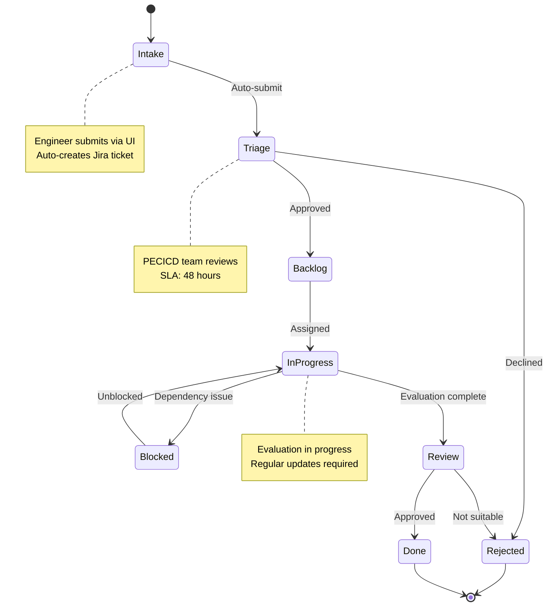
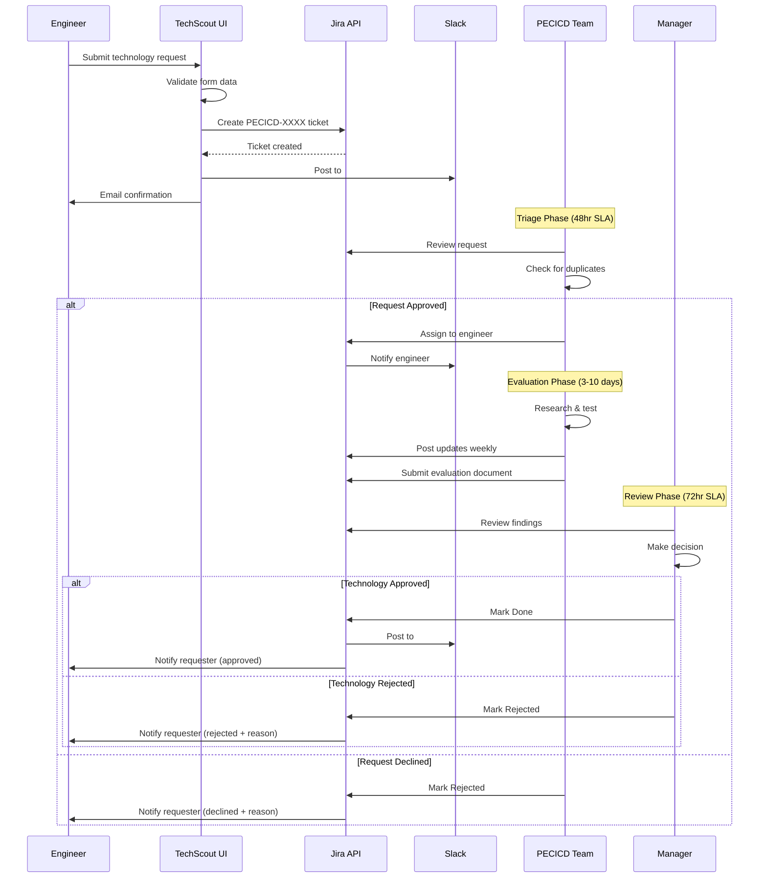
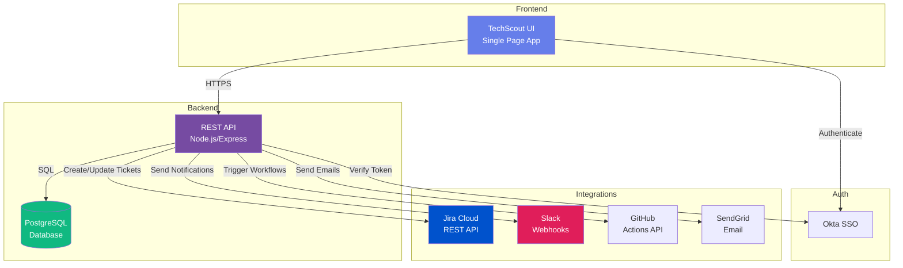
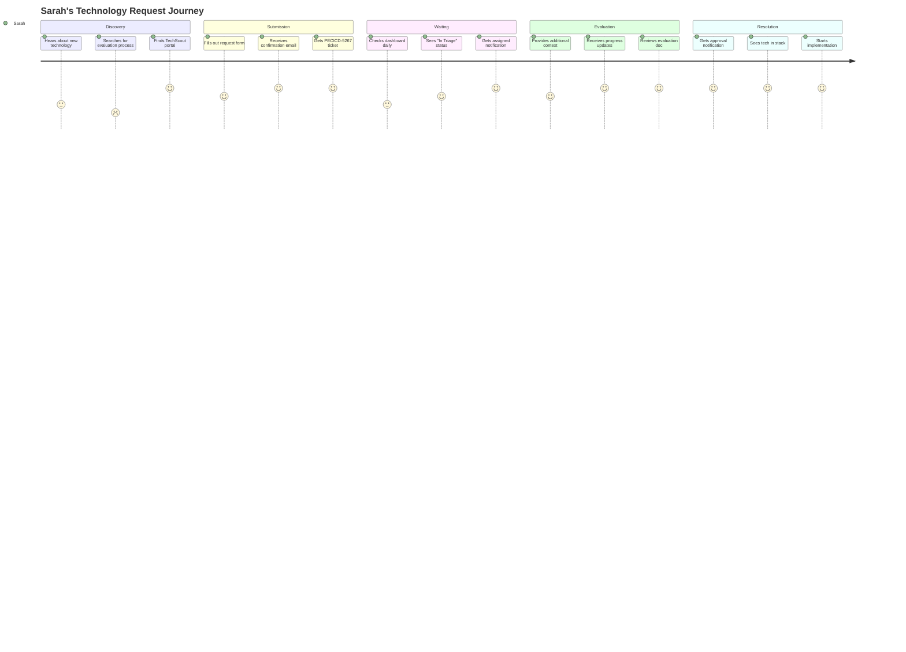
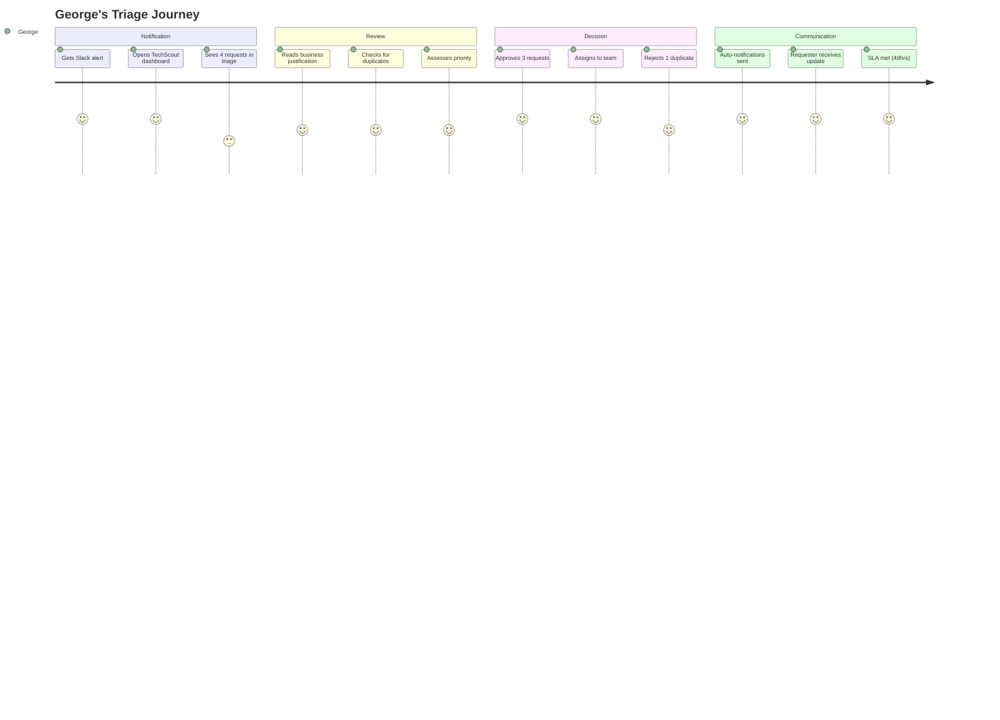
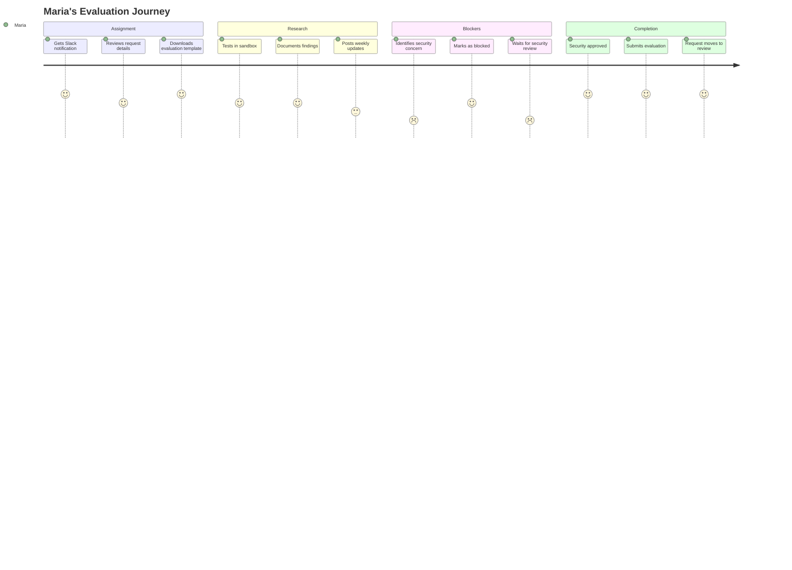
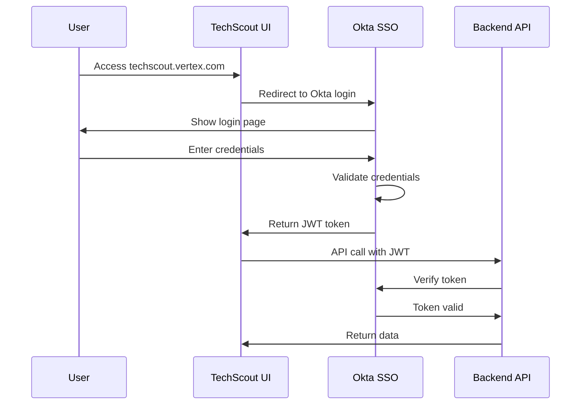
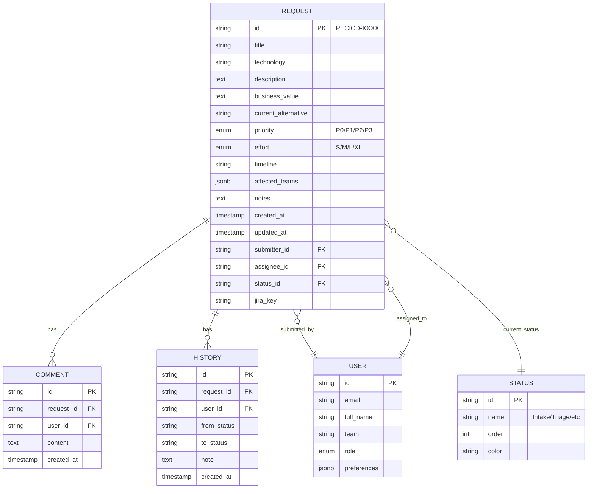

# TechScout Ticketing Workflow Design
## PECICD-5266: Enabler Story Documentation

**Author:** Productivity Engineering CI/CD Team  
**Date:** February 24, 2026  
**Status:** Design Complete  
**Related Epic:** PRODENG-343 (UI Tool for TechScout)

---

## 📋 Executive Summary

This document defines the complete workflow design for TechScout - the self-service technology evaluation request system for Vertex Inc. It covers the end-to-end process from request submission to evaluation completion, including state transitions, integration points, and automation requirements.

**Key Goals:**
- Reduce technology evaluation request time from 30+ days to <10 days
- Eliminate lost requests (currently 30% loss rate)
- Provide transparency and accountability
- Enable data-driven decision making
- Prevent duplicate work (currently 2-3x per year)

---

## 🎯 Workflow Overview



---

## 📊 Workflow States

### 1. **INTAKE** (Initial)
- **Triggered by:** Engineer submits request via TechScout UI
- **Duration:** Instantaneous (automated)
- **Owner:** System (automated)
- **Actions:**
  - ✅ Validate form data
  - ✅ Auto-create Jira ticket in PECICD project
  - ✅ Generate unique request ID (PECICD-XXXX)
  - ✅ Send Slack notification to #techscout-requests channel
  - ✅ Email confirmation to requester
  - ✅ Add to "Awaiting Triage" dashboard view

**Exit Criteria:** Ticket created successfully

---

### 2. **TRIAGE** (Review)
- **Triggered by:** Automatic (immediately after Intake)
- **Duration:** SLA = 48 hours
- **Owner:** PECICD Team Lead
- **Actions:**
  - 🔍 Review business justification
  - 🔍 Check for duplicate requests
  - 🔍 Assess effort vs. value
  - 🔍 Assign priority (P0-P3)
  - 🔍 Determine if evaluation needed

**Decision Points:**
- **APPROVE** → Move to Backlog
  - Add effort estimate (S/M/L/XL)
  - Assign to engineer
  - Set expected completion date
  
- **REJECT** → Close as "Not suitable"
  - Document reason
  - Suggest alternatives
  - Notify requester

**Exit Criteria:** Decision made and documented

---

### 3. **BACKLOG** (Queue)
- **Triggered by:** Approval in Triage
- **Duration:** Variable (depends on priority)
- **Owner:** PECICD Team Lead
- **Actions:**
  - 📋 Request in priority queue
  - 📋 Visible in "All Requests" dashboard
  - 📋 Can be re-prioritized

**Exit Criteria:** Engineer available and assigned

---

### 4. **IN PROGRESS** (Active)
- **Triggered by:** Engineer assignment
- **Duration:** 3-10 days (depends on effort)
- **Owner:** Assigned PECICD Engineer
- **Actions:**
  - 🔬 Research technology
  - 🔬 Test in sandbox environment
  - 🔬 Document findings (pros/cons)
  - 🔬 Assess security/compliance implications
  - 🔬 Estimate implementation effort
  - 🔬 Post updates to Jira (min 1x per week)

**Can transition to:**
- **BLOCKED** if dependencies identified
- **REVIEW** when evaluation complete

**Exit Criteria:** Evaluation document completed

---

### 5. **BLOCKED** (Paused)
- **Triggered by:** Dependency/blocker identified
- **Duration:** Until blocker resolved
- **Owner:** Assigned Engineer + Blocker owner
- **Actions:**
  - ⛔ Document blocker reason
  - ⛔ Identify blocker owner
  - ⛔ Track blocker resolution
  - ⛔ Update requester on delay

**Common Blockers:**
- Waiting for vendor demo
- Security review required
- Budget approval needed
- Infrastructure not ready

**Exit Criteria:** Blocker resolved

---

### 6. **REVIEW** (Approval)
- **Triggered by:** Evaluation completed
- **Duration:** SLA = 72 hours
- **Owner:** PECICD Team Lead + Engineering Manager
- **Actions:**
  - ✅ Review evaluation document
  - ✅ Assess recommendation
  - ✅ Check compliance/security sign-off
  - ✅ Make final decision

**Decision Points:**
- **APPROVE** → Move to Done
  - Add to approved tech stack
  - Schedule implementation if needed
  - Update documentation
  
- **REJECT** → Close as "Not recommended"
  - Document reasons
  - Archive findings for future reference

**Exit Criteria:** Final decision made

---

### 7. **DONE** (Complete)
- **Triggered by:** Approval in Review
- **Duration:** Terminal state
- **Owner:** System
- **Actions:**
  - ✅ Close Jira ticket
  - ✅ Update tech stack inventory
  - ✅ Notify requester
  - ✅ Post to #engineering-announcements
  - ✅ Add to knowledge base

**Metrics Captured:**
- Time in each state
- Total resolution time
- Effort estimation accuracy

---

### 8. **REJECTED** (Closed)
- **Triggered by:** Rejection in Triage or Review
- **Duration:** Terminal state
- **Owner:** System
- **Actions:**
  - ❌ Close Jira ticket
  - ❌ Document rejection reason
  - ❌ Notify requester with explanation
  - ❌ Archive for future reference

---

## 🔄 End-to-End Process Flow



---

## 🏗️ System Architecture



---

## 👥 User Personas & Journeys

### Persona 1: **Engineering Requester** (Sarah - Backend Developer)

**Journey: Submitting a Request**



**Pain Points (OLD WAY):**
- 😞 Sent email, never got response
- 😞 No visibility into status
- 😞 Had to follow up 5 times
- 😞 Request took 30+ days

**Benefits (NEW WAY):**
- 😊 Self-service portal (no waiting)
- 😊 Real-time status updates
- 😊 Transparent process (10 days)
- 😊 Email + Slack notifications

---

### Persona 2: **PECICD Triager** (George - Team Lead)

**Journey: Triaging Requests**



**Pain Points (OLD WAY):**
- 😞 Requests scattered (email/Slack/meetings)
- 😞 Manual Jira ticket creation
- 😞 Lost track of requests
- 😞 No metrics on throughput

**Benefits (NEW WAY):**
- 😊 Centralized queue
- 😊 Auto-Jira creation
- 😊 Dashboard visibility
- 😊 Built-in metrics

---

### Persona 3: **PECICD Engineer** (Maria - Evaluator)

**Journey: Evaluating Technology**



---

## 🔗 Integration Points

### 1. **Jira Cloud Integration**

**API Endpoints Used:**
```
POST /rest/api/3/issue
  - Create new ticket in PECICD project
  - Fields: summary, description, priority, labels, custom fields

PUT /rest/api/3/issue/{issueKey}
  - Update ticket status
  - Add comments
  - Change assignee

POST /rest/api/3/issue/{issueKey}/transitions
  - Transition between workflow states

GET /rest/api/3/search
  - Query existing tickets
  - Duplicate detection
```

**Webhook Events:**
- `jira:issue_updated` → Sync status to TechScout
- `jira:issue_commented` → Show in activity timeline
- `jira:issue_transitioned` → Update dashboard

**Custom Fields Required:**
- `customfield_10050`: Technology Name
- `customfield_10051`: Business Value
- `customfield_10052`: Current Alternative
- `customfield_10053`: Affected Teams
- `customfield_10054`: Effort Estimate

---

### 2. **Slack Integration**

**Channels:**
- `#techscout-requests`: New request notifications
- `#engineering-announcements`: Approved technologies
- `#pecicd-team`: Team assignments

**Notification Templates:**

**New Request:**
```
🆕 New TechScout Request: PECICD-5267
📋 Title: Kubernetes for Container Orchestration
👤 Requester: Sarah Chen
💼 Business Value: Improve deployment reliability
🔗 View Details: https://techscout.vertex.com/requests/PECICD-5267
```

**Status Update:**
```
🔄 TechScout Update: PECICD-5267
📊 Status: Triage → In Progress
👨‍💻 Assigned: Maria Rodriguez
⏱️ ETA: 7 days
```

**Approval:**
```
✅ Technology Approved: Kubernetes
📋 Request: PECICD-5267
👤 Requester: Sarah Chen
📖 Documentation: https://techstack.vertex.com/kubernetes
🎉 Ready for implementation!
```

---

### 3. **Email Integration (SendGrid)**

**Email Types:**

1. **Confirmation Email**
   - Sent: Immediately after submission
   - Template: `techscout-confirmation.html`
   - Contains: Request ID, next steps, SLA

2. **Status Update Email**
   - Sent: On state transitions
   - Template: `techscout-status-update.html`
   - Contains: New status, timeline, action items

3. **Assignment Email**
   - Sent: When engineer assigned
   - Template: `techscout-assignment.html`
   - Contains: Request details, evaluation template

4. **Weekly Digest**
   - Sent: Every Monday 9am
   - Template: `techscout-digest.html`
   - Contains: Open requests, aging items, metrics

---

### 4. **GitHub Actions Integration**

**Triggered Events:**
- Technology approved → Auto-create PR to update tech stack docs
- New tool approved → Trigger installation playbook
- Security scan required → Run automated security checks

**Workflow Example:**
```yaml
name: TechScout - Update Tech Stack
on:
  repository_dispatch:
    types: [techscout-approved]

jobs:
  update-docs:
    runs-on: ubuntu-latest
    steps:
      - name: Checkout
        uses: actions/checkout@v3
      
      - name: Update tech-stack.md
        run: |
          echo "## ${{ github.event.client_payload.technology }}" >> docs/tech-stack.md
          echo "${{ github.event.client_payload.description }}" >> docs/tech-stack.md
      
      - name: Create PR
        uses: peter-evans/create-pull-request@v5
        with:
          title: "Add ${{ github.event.client_payload.technology }} to tech stack"
          body: "Auto-generated from TechScout request ${{ github.event.client_payload.request_id }}"
```

---

## 📈 Metrics & KPIs

### Lead Time Metrics

```mermaid
gantt
    title Target Timeline (Days)
    dateFormat X
    axisFormat %d
    
    section Ideal Flow
    Intake           :0, 1d
    Triage           :1, 2d
    Backlog          :3, 2d
    In Progress      :5, 7d
    Review           :12, 3d
    
    section With Blocker
    Intake           :0, 1d
    Triage           :1, 2d
    Backlog          :3, 2d
    In Progress      :5, 4d
    Blocked          :9, 5d
    In Progress      :14, 3d
    Review           :17, 3d
```



**Key Performance Indicators:**

| Metric | Target | Current (Baseline) |
|--------|--------|-------------------|
| **Triage Time** | < 48 hours | 5-7 days |
| **Total Resolution Time** | < 10 days | 30+ days |
| **Lost Request Rate** | 0% | 30% |
| **Duplicate Evaluations** | 0 | 2-3 per year |
| **Requester Satisfaction** | > 8/10 | Unknown |
| **Team Utilization** | 70-85% | Unknown |

**Dashboard Metrics:**
- Requests per month
- Average time in each state
- Success rate (approved vs rejected)
- Top requested technologies
- Request volume by team
- SLA compliance rate

---

## 🔐 Security & Compliance

### Authentication & Authorization

**Auth Flow:**


**Role-Based Access Control:**

| Role | Permissions |
|------|-------------|
| **Requester** | Submit requests, view own requests, add comments |
| **PECICD Member** | View all requests, update status, assign, evaluate |
| **PECICD Lead** | All PECICD permissions + triage, approve/reject |
| **Manager** | All permissions + final approval, reports |
| **Admin** | System configuration, user management |

**Data Classification:**
- Request data: **Internal** (Vertex employees only)
- Evaluation docs: **Confidential** (PECICD team only)
- Approved tech list: **Public** (all employees)

---

## 📝 Data Model



---

## 🚀 Implementation Phases

### Phase 1: MVP (Weeks 1-2)
- ✅ TechScout UI (COMPLETED)
- ⏳ Backend API (Node.js/Express)
- ⏳ PostgreSQL database
- ⏳ Jira integration (create tickets)
- ⏳ Basic email notifications

**Acceptance Criteria:**
- Engineer can submit request
- Request creates Jira ticket
- PECICD team can view in dashboard
- Email confirmation sent

---

### Phase 2: Workflow (Weeks 3-4)
- ⏳ Status transitions
- ⏳ Assignment logic
- ⏳ Slack notifications
- ⏳ Comment system
- ⏳ Activity timeline

**Acceptance Criteria:**
- Requests move through states
- Team receives notifications
- Requester sees progress updates

---

### Phase 3: Advanced Features (Weeks 5-6)
- ⏳ Duplicate detection (AI-powered)
- ⏳ Metrics dashboard
- ⏳ Weekly digest emails
- ⏳ GitHub Actions integration
- ⏳ Export to CSV/PDF

**Acceptance Criteria:**
- System flags duplicates
- Managers can view metrics
- Tech stack auto-updated

---

### Phase 4: Optimization (Weeks 7-8)
- ⏳ Performance tuning
- ⏳ Mobile app (optional)
- ⏳ Advanced search/filters
- ⏳ AI recommendations
- ⏳ User feedback loop

---

## 🧪 Testing Strategy

### Unit Tests
- API endpoint testing (Jest)
- Form validation logic
- State transition rules
- Integration connectors

### Integration Tests
- Jira API connectivity
- Slack webhook delivery
- Email sending (SendGrid)
- Database transactions

### End-to-End Tests
- Full request lifecycle (Cypress)
- User journey testing
- Cross-browser compatibility
- Mobile responsiveness

### User Acceptance Testing
- PECICD team pilot (5 users)
- Engineering beta group (20 users)
- Feedback collection
- Iteration cycle

---

## 📚 Documentation Deliverables

1. ✅ **This Workflow Design Doc** (PECICD-5266)
2. ✅ **TechScout UI** (PRODENG-343)
3. ⏳ **API Documentation** (Swagger/OpenAPI)
4. ⏳ **User Guide** (How to submit/triage)
5. ⏳ **Admin Guide** (Configuration/maintenance)
6. ⏳ **Runbook** (Troubleshooting/operations)

---

## 🎯 Success Criteria

**Workflow Design (This Document):**
- ✅ All states defined with entry/exit criteria
- ✅ State transition diagram created
- ✅ Integration points documented
- ✅ User journeys mapped
- ✅ Metrics identified
- ✅ Security reviewed

**Implementation (Future):**
- ⏳ 80% of requests resolved < 10 days
- ⏳ 0% lost request rate
- ⏳ 90%+ user satisfaction
- ⏳ 100% SLA compliance
- ⏳ Zero duplicate evaluations

---

## 📞 Stakeholders

| Role | Name | Responsibility |
|------|------|----------------|
| **Product Owner** | George Harley | Workflow approval, prioritization |
| **Tech Lead** | Maria Rodriguez | Architecture, integrations |
| **PECICD Team** | Full team | UAT, feedback, triage process |
| **Engineering Managers** | Various | Final approval process |
| **Security Team** | Security Eng | Auth/authorization review |

---

## 🔄 Change Log

| Date | Version | Changes | Author |
|------|---------|---------|--------|
| 2026-02-24 | 1.0 | Initial workflow design | PECICD Team |

---

## ✅ Approval

**Workflow Design Approved by:**
- [ ] PECICD Team Lead
- [ ] Engineering Manager
- [ ] Security Team
- [ ] Product Owner

**Next Steps:**
1. Review this design doc in team meeting
2. Get stakeholder sign-off
3. Create implementation tickets
4. Begin Phase 1 (MVP) development

---

*This document fulfills the requirements of PECICD-5266: TechScout Ticketing Workflow Design*
